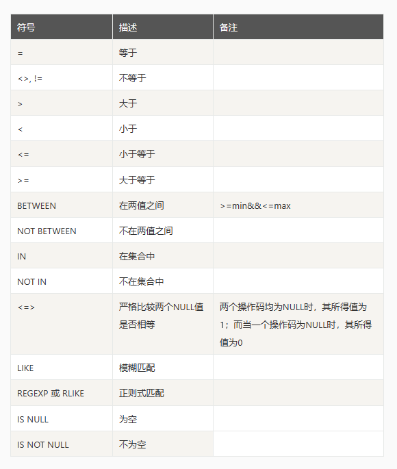
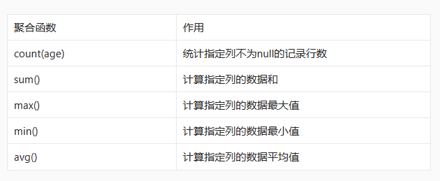

## DQL

DQL（Data Query Language）即数据库查询语言，用来查询所需要的信息，在查询的过程中，需要判断所查询的数据与表之间的关，我们可以使用select语句来查询数据

SELECT [ALL|DISTINCT]
<目标列表达式> [别名] [ ,<目标列表达式> [别名]] …
FROM <表名或视图名> [别名] [ ,<表名或视图名> [别名]] …
[WHERE <条件表达式>]
[GROUP BY <列名1> [HAVING <条件表达式>]]
[ORDER BY <列名2> [ASC|DESC]
[limit <数字或者列表>]


### 分页、分组、排序

select *(列名称)  from  表名称 where 条件
1. 查询语句中你可以使用一个或者多个表，表之间使用逗号(,)分割，并使用WHERE语句来设定查询条件;
2. SELECT 命令可以读取一条或者多条记录;
3. 使用星号（*）来代替其他字段，SELECT语句会返回表的所有字段数据
4. 使用 WHERE 语句来包含任何条件。
5. 使用 LIMIT 属性来设定返回的记录数。
6. OFFSET指定SELECT语句开始查询的数据偏移量。默认情况下偏移量为0。

```sql
-- 查询所有
select * from score;
-- 查询指定字段
select id, student from score;
-- 列别名称
select id as `索引`, student as `学生` from score;
-- 去重复值
select distinct class from score;
-- 查询结果是表达式
select id, student, score + 20 as score  from score;

--查询学生的名称是张三
select id, student from score where student = '张三';
--查询学生的名称不是张三
select id, student from score where student != '张三';

--查询学生分数是为520
select id, student, score  from score  where score = 520;
--查询学生分数是大于520
select id, student, score  from score  where score > 520;
--查询学生分数是小于520
select id, student, score  from score  where score < 520;
--查询学生分数是500-720之间
select id, student, score  from score  where score > 500 and  score < 700;
select id, student, score  from score  where score > 500 &&  score < 700;
select id, student, score  from score  where score between 500 and 700;
--查询分数是在450或者520的学生
select id, student, score  from score  where score in (450, 520);
select id, student, score  from score  where score = 450 or score = 520;
select id, student, score  from score  where score = 450 || score = 520;

--查询名称含有“张”
select id, student, score  from score  where student like '%张%';

--查询名称开头“张”
select id, student, score  from score  where student like '张%';
--查询名称第二字“汉”
select id, student, score  from score  where student like '_张%';

```

### 运算符

加、减、乘、除、求余 

`+ - * / %`

### 比较运算符




### 逻辑运算符

非、与、或、异或
NOT !  、AND、 OR、 XOR

### 排序

1. asc代表 升序排列 desc代表降序排列 默认是为升序;升序就是从小到大、降序就是从大到小
2. order by 可以支持单个字段，多个字段 ；
3. order by 放在查询语句最后面，limit 分页除外

```sql
-- 按分数从小到大
select * from score order by score asc;
-- 按分数从大到小
select * from score order by score desc;
-- 按分数从大到小 当分数相同 按id从大到小
select *  from score order by score desc, id desc;
```

### 分页

```sql
select * from score limit 0, 1
```

### 聚合查询



```sql
-- 查询总条数
select count(0) from score;
-- 查询班级不为null总条数
select count(class) from score;
-- 3-1 学生的总分
select sum(score) from score where class = '3-1';
-- 学生的 最低分 最高分 平均分
select min(score), max(score), avg(score)  from score;
```

### 分组查询

注意分组  返回列 只能为 分组的字段或者聚合函数；

分组之后的条件筛选
1. 分组之后对统计结果进行分组条件筛选 必须使用having，不能够使用where
2. HAVING语句通常与GROUP BY语句联合使用，用来过滤由GROUP BY语句返回的记录集

注意事项 ：
1、where 后不能跟聚合函数，因为where执行顺序大于聚合函数。
2、where 子句的作用是在对查询结果进行分组前，将不符合where条件的行去掉，即在分组之前过滤数据，条件中不能包含聚组函数，使用where条件显示特定的行。
3、having 子句的作用是筛选满足条件的组，即在分组之后过滤数据，条件中经常包含聚组函数，使用having 条件显示特定的组，也可以使用多个分组标准进行分组。

```sql
select class, student, score
from score a
where (select count(score) from score where class = a.class and a.score < score) < 2
order by a.class, a.score desc;
```